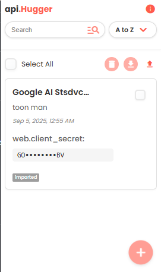

# 🔐 api.Hugger

**A Modern, Secure API Key Management Extension**



api.Hugger is a powerful Chrome extension designed to help developers and API enthusiasts securely store, organize, and manage their API keys with an intuitive and modern interface.


## ✨ Key Features

### 🔒 **Secure Storage**
- **Chrome Sync Storage**: API keys are securely stored using Chrome's built-in sync storage
- **Automatic Masking**: API keys are automatically masked in the interface for security
- **Pin Protection**: Mark sensitive fields as "pinned" for additional masking

### 📊 **Smart Organization**
- **Vendor & Account Management**: Organize APIs by vendor and account names
- **Custom Tagging System**: Create and assign custom tags for better categorization
- **Dynamic Tag Filtering**: Filter APIs by specific tags with an intuitive dropdown
- **Custom Fields**: Add unlimited custom key-value pairs for additional metadata

### 🔍 **Advanced Search & Filtering**
- **Real-time Search**: Instantly search across vendors, accounts, tags, and API keys
- **Multi-field Search**: Search extends to custom fields and imported JSON data
- **Smart Sorting**: Sort by vendor (A-Z, Z-A), tags, or creation date
- **Responsive Filtering**: Combine search terms with tag filters for precise results

### 📥📤 **Import & Export Capabilities**
- **JSON Import**: Import API configurations from JSON files
- **Bulk Export**: Export selected APIs to JSON format
- **Duplicate Detection**: Automatic handling of duplicate entries during import
- **Data Preservation**: Maintains all metadata during import/export operations

### 🎛️ **Bulk Operations**
- **Select All**: Quickly select all visible APIs with one click
- **Bulk Delete**: Remove multiple APIs simultaneously
- **Bulk Export**: Export multiple selected APIs at once
- **Smart Selection**: Visual feedback for selected items

### 🎨 **Modern User Interface**
- **Responsive Design**: Clean, modern interface that adapts to content
- **Material Design Icons**: Intuitive iconography throughout the interface
- **Smooth Animations**: Polished transitions and hover effects
- **Custom Dropdown**: Advanced dropdown with search and filtering capabilities
- **Professional Styling**: Consistent design language with attention to detail

## 🚀 Installation

### From Chrome Web Store
*Coming Soon - Extension will be available on the Chrome Web Store*

### Manual Installation (Developer Mode)
1. Download or clone this repository
2. Open Chrome and navigate to `chrome://extensions/`
3. Enable "Developer mode" in the top right corner
4. Click "Load unpacked" and select the extension directory
5. The api.Hugger icon will appear in your Chrome toolbar

## 📖 Usage Guide

### Adding Your First API Key
1. Click the api.Hugger icon in your Chrome toolbar
2. Click the "+ Add API" button
3. Fill in the required fields:
   - **Vendor**: The API provider (e.g., "OpenAI", "Stripe")
   - **Account**: Your account identifier
   - **API Key**: Your actual API key
   - **Tags**: Comma-separated tags for organization
4. Add custom fields if needed
5. Click "Save" to store your API key

### Organizing with Tags
- Use descriptive tags like `production`, `development`, `payment`, `ai`
- Tags appear in the sort dropdown for quick filtering
- Multiple tags can be assigned to each API key

### Advanced Features

#### Custom Fields
- Add unlimited key-value pairs for additional metadata
- Mark any custom field as the "API key" for masking
- Perfect for storing related information like endpoints, documentation links, etc.

#### JSON Import
- Import complex API configurations from JSON files
- Automatically detects and preserves nested data structures
- Pin sensitive fields for security masking
- Handles large datasets with ease

#### Search & Filter
- Use the search bar to find APIs instantly
- Combine search terms with tag filters
- Search works across all fields including custom data

## 🛡️ Security Features

### Data Protection
- **Local Storage Only**: All data stays on your device via Chrome sync
- **No External Servers**: No data is transmitted to external services
- **Automatic Masking**: API keys are visually masked by default
- **Secure Display**: Sensitive information is protected in the interface

### Privacy
- **No Tracking**: Extension doesn't track user behavior
- **No Analytics**: No usage data is collected
- **Minimal Permissions**: Only requires storage permission

## 🔧 Technical Specifications

### Browser Compatibility
- **Chrome**: Version 88+ (Manifest V3 support)
- **Chromium-based browsers**: Edge, Brave, Opera (with Chrome extension support)

### Storage
- **Chrome Sync Storage**: Automatically syncs across devices
- **Storage Limit**: Follows Chrome's sync storage quotas
- **Data Format**: JSON with automatic serialization

### Performance
- **Lightweight**: Minimal resource usage
- **Fast Search**: Optimized filtering algorithms
- **Responsive UI**: Smooth interactions even with large datasets

## 📁 Project Structure

```
api.Hugger/
├── manifest.json          # Extension configuration
├── popup.html            # Main interface HTML
├── popup.js              # Core functionality
├── styles.css            # Modern styling
├── images/               # Extension icons
│   ├── icon16.svg
│   ├── icon48.svg
│   └── icon128.svg
├── README.md             # Documentation
└── LICENSE               # MIT License
```

## 🤝 Contributing

We welcome contributions!

### Development Setup
1. Clone the repository
2. Load the extension in Chrome (Developer mode)
3. Make your changes
4. Test thoroughly
5. Submit a pull request


## 📄 License

This project is licensed under the MIT License - see the [LICENSE](LICENSE) file for details.


**Made with ❤️ for developers who value security and organization**

*api.Hugger - Hug your APIs with confidence* 🤗
